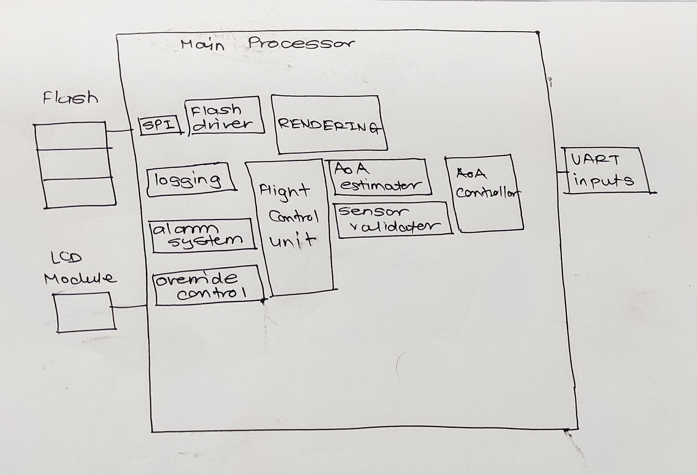
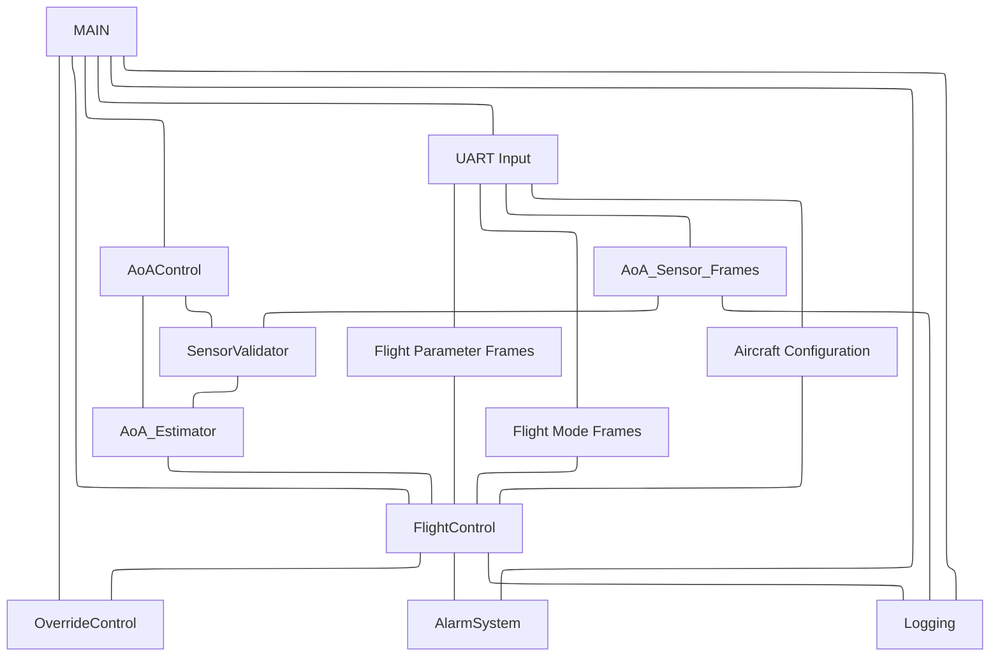
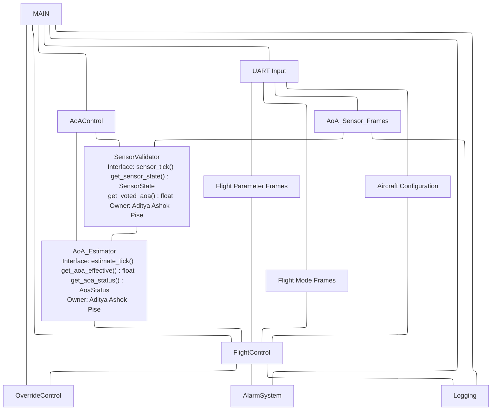

# Lab: Firmware Architecture Design
## AoA Controller – From Behavioral Models to Structured Implementation

> **Course:** CS G523 – Software for Embedded Systems
> **Project:** p2-aoa-controller – Aircraft Angle-of-Attack Safety Controller
> **Submission Type:** Group document with individual module ownership

---

## Alignment Note

The faculty specification (p2-aoa-controller) provides **three independent AoA sensors (S1, S2, S3)** arriving on independent UART frame streams alongside independent flight parameter and flight mode frames. Exact thresholds, state machine structure, sensor fusion policy, and control law equations are intentionally left to the team. This document reflects those constraints and records our design decisions explicitly. Our sensor voting algorithm uses pairwise difference analysis across all three sensors to identify and reject the outlier before computing the final AoA estimate.

---

## Step 1 – Exploratory Block Sketch

Preliminary software block decomposition derived from the project spec, UART frame definitions, and our behavioral statechart.



**Key observations from the sketch:**
- UART Parser is the sole hardware-facing data source — all other modules depend only on its clean interface.
- SensorValidator and AoA Estimator are deliberately separated: validation is a question of data integrity, estimation is a question of what value to use.
- FlightControlFSM is the sole decision-maker for authority transitions; it drives both actuation and alerting.
- FaultLogger is a pure sink with no outbound dependencies.

---

## Step 2 – Hierarchy of Control Diagram

**System state is owned by:** `FlightControlFSM` (flight phase + control authority level)


- We are using the *Coordinated Controller Pattern*
- Assumption: Timestamp for both AoA sensor Frame and Flight Parameter Frame will always same.

---

## Step 3 – Dependency Constraints

### Allowed Dependency Directions

Data and control flow **strictly top-down**:

```
UART_FrameParser        AircraftConfig
       |                      |
       +-----------+----------+
                   |
           SensorValidator
                   |
            AoA_Estimator
                   |
         FlightControlFSM
           /             \
 ElevatorCmdMgr      WarningManager
           \             /
            FaultLogger
```

### Forbidden Dependencies

| Forbidden Direction | Reason |
|---------------------|--------|
| `FaultLogger` to any module | Logger is a pure sink; no outbound calls allowed |
| `ElevatorCmdManager` to `FlightControlFSM` | No upward feedback; commands are one-way |
| `WarningManager` to `FlightControlFSM` | Responses are external (pilot), not internal callbacks |
| `SensorValidator` to `FlightControlFSM` | Sensor layer must not know about control decisions |
| `UART_FrameParser` to any processing module | Parser is a pure data source |
| Any module reading another module's internal struct fields directly | All access via public interface functions only |

### Global State Policy

- **Zero global variables.** All persistent state lives in per-module context structs.
- `AircraftConfig` is loaded once at `config_init()` and is thereafter logically const.
- `AoA_EFFECTIVE` and `aoa_status` are exclusively owned by `AoA_Estimator` and published only through its getter interface.

### Cross-Module Data Sharing Policy

- All inter-module communication is via explicit function call at each scheduler tick.
- No shared memory regions or message queues in this iteration.
- `FaultLogger` is the only module callable from all others; this cross-cutting permission is limited strictly to the `log_event()` call.

---

## Step 4 – Behavioral Mapping Table

| Module | Related Statechart States | Related Transitions | Related Use Cases |
|--------|--------------------------|---------------------|-------------------|
| UART_FrameParser | — (infrastructure layer) | Drives all sensor-update and mode-change triggers | UC-1, UC-3 |
| AircraftConfig | — (configuration) | Loaded at boot; affects threshold lookup in FSM | UC-1 |
| SensorValidator | SensorsAgree, SensorsDisagree, SensorFailed, Failed | sensor_stale_or_missing, abs(S1-S2) > threshold, disagree_timeout, sensor_recovered | UC-1, UC-3 |
| AoA_Estimator | Implicit — produces AoA_EFFECTIVE or UNKNOWN | Transitions into/out of degraded estimation | UC-1, UC-3 |
| FlightControlFSM | TK/CL/CR/LD_Normal, _Caution, _Protection, _Override; outer TAKEOFF, CLIMB, CRUISE, LANDING | AoA approaching stall, almost stalling/overspeeding, stall happening, AoA return to safe, Flight_Mode_Changed, go_around_detected | UC-1, UC-2 |
| ElevatorCmdManager | Implied by _Protection and _Override active states | Entry/exit of Protection and Override | UC-2 |
| WarningManager | Implied by _Caution, _Protection, _Override states | Entry of Caution triggers alert; pilot response timer | UC-2 |
| FaultLogger | All failure states; all Override entries | SensorFailed, Failed, _Override entry | UC-3 |

---

## Step 5 – Interaction Summary

| Module | Calls | Called By | Shared Data? |
|--------|-------|-----------|--------------|
| UART_FrameParser | — | SensorValidator, FlightControlFSM | No |
| AircraftConfig | — | FlightControlFSM, ElevatorCmdManager | No |
| SensorValidator | UART_FrameParser, FaultLogger | AoA_Estimator | No |
| AoA_Estimator | SensorValidator | FlightControlFSM | No |
| FlightControlFSM | AoA_Estimator, UART_FrameParser, AircraftConfig, ElevatorCmdManager, WarningManager, FaultLogger | AoA_Controller_Top | No |
| ElevatorCmdManager | AircraftConfig, FaultLogger | FlightControlFSM | No |
| WarningManager | FaultLogger | FlightControlFSM | No |
| FaultLogger | — | All modules | No |

**Coupling observations:**
- `FlightControlFSM` has the highest fan-out (6 direct callees) — it is the architectural complexity hotspot and the highest-priority module for interface stability.
- `FaultLogger` has the highest fan-in (called by 5 modules) — its interface must be minimal and immutable.
- `UART_FrameParser` is called by two modules (SensorValidator and FSM directly). This is a deliberate shortcut: flight mode and airspeed are control context inputs, not sensor-integrity concerns, so routing them through SensorValidator would violate layer separation.

---

## Step 6 – Architectural Rationale

**Layered safety pipeline.** The architecture enforces a strict top-down dependency hierarchy from raw bytes to validated sensor state to fused estimate to safety decision to physical output. This makes data provenance explicit and traceable — a requirement for safety-critical embedded software — and prevents the circular reasoning that is dangerous in protection systems.

**Why SensorValidator and AoA_Estimator are separate.** Validation asks "can I trust this data?" Estimation asks "given what I trust, what is the AoA?" Merging them would couple data integrity logic with selection logic. The split also makes it straightforward to extend to three sensors later without touching the estimator interface.

**Why no global state.** Per-module context structs make each module's state explicit and enable isolated unit testing. This is important both for correctness now and for extension to an RTOS or multi-interrupt architecture later.

**Why FlightControlFSM is the sole authority arbiter.** It is the only module with simultaneous access to aircraft configuration, flight phase, airspeed, and AoA validity. Distributing authority decisions would require shared state and reintroduce the coupling the layered design is trying to eliminate.

**Why flight mode and airspeed bypass SensorValidator.** These are control context inputs, not AoA sensor integrity data. Routing them through SensorValidator would give the sensor layer knowledge of control logic.

**Acknowledged tradeoff.** The pipeline introduces one scheduler-tick of latency per layer. For a stall protection system this latency budget must be validated against the aircraft's minimum response time requirement (outside scope of this lab, noted for downstream verification).

---

## Step 7 – Task Split

| Member | Module(s) Owned |
|--------|-----------------|
| Siddharth | `UART_FrameParser`, `AircraftConfig` |
| Aditya A Pise | `SensorValidator`, `AoA_Estimator` |
| Srishti Singh | `FaultLogger` |
| Vishurt | `FlightControlFSM` |
| Aniket Saxena| `ElevatorCmdManager`, `WarningManager` |

Each member is responsible for: interface definition, encapsulation rules, safeguards, and module-level tests for their assigned modules.

> Commit and push `docs/sections/architecture.md` at this stage before proceeding to individual specifications.

---

## Step 8 – Individual Module Specifications

---

### Module: UART_FrameParser

#### Purpose and Responsibilities
- Parse raw UART bytes into structured sensor frames.
- Detect malformed, truncated or corrupted frames.


#### Inputs
- **Data received:**  Raw serial byte stream from UART hardware peripheral. 
- **Assumptions about inputs:**  
    - Incoming frames follow a fixed protocol: [START][ID][LEN][PAYLOAD][CRC].
    - Byte order is in little endian.

#### Outputs
- **Data provided:**  FrameReady(frame) or FrameError(error_code).
- **Guarantees provided:**
    - Only syntactically valid frames are forwarded.
    - Corrupted or incomplete frames are dropped.
    - Parser state machine always recovers after errors.


#### Internal State (Encapsulation)
- **State variables:**  parser_state, buffer[FRAME_MAX_SIZE], computed_crc
- **Configuration parameters:**  FRAME_MAX_SIZE
- **Internal invariants:**  Allowed message IDs (AoA1, AoA2, AoA3, Airspeed)

#### Initialization / Deinitialization
- **Init requirements:**  
     - Reset all internal state to IDLE.
     - Clear buffer and indices.
     - Configure UART peripheral to generate byte events.
- **Shutdown behavior:**  
     - Stop accepting new bytes.
     - Move to IDLE and clear internal buffers.
- **Reset behavior:**  
     - Full reinitialization identical to Init.

#### Basic Protection Rules (Light Safeguards):
- Reject frames where LEN > FRAME_MAX_SIZE. 
- Reject frames where CRC does not match.
- Reset parser to IDLE when:
     - Byte timeout occurs
     - Overrun/framing error occurs
     - Invalid start byte encountered
- Escalate as:
     - FrameError(BAD_CRC)
     - FrameError(BAD_LENGTH)
     - FrameError(MALFORMED)

#### Module-Level Tests

| Test ID | Purpose | Stimulus | Expected Outcome |
|--------|--------|----------|-----------------|
| UART-T1 | Validate correct frame parsing | Feed a clean valid frame byte-by-byte |FrameReady event emitted with correct fields |
| UART-T2 |Detect CRC error |Modify CRC in last byte|FrameError(BAD_CRC) emitted; parser resets|
| UART-T3|Handle malformed header | Provide random bytes without start byte| Parser ignores and stays in IDLE|
| UART-T4| Handle truncated frame| Cut stream mid-payload |Parser resets and emits no frame |
| UART-T5| Recover after error| Inject invalid length then send valid frame| Parser resets and correctly parses next valid frame|


---

### Module: AircraftConfig

#### Purpose and Responsibilities
- Store and serve static configuration parameters for AoA thresholds.
- Maintain flight-mode-specific protection and caution limits.
- Provide lookup functions for AoA Controller.
- Encapsulate all constants so no other module hardcodes thresholds.


#### Inputs
- **Events received:**  
   - ConfigLoadRequest (on boot)
   - FlightModeChanged(new_mode)
- **Data received:**  
   - External configuration file (optional future enhancement).
   - Flight mode value from FlightMode module.
- **Assumptions about inputs:**  
   - Flight mode is always valid (CRUISE, TAKEOFF, LANDING).
   - Configuration parameters do not change during flight except via mode transitions.

#### Outputs
- **Data provided:**  NONE
- **Guarantees provided:**
    - Threshold values returned are always valid for the current mode.
    - Values remain constant during an evaluation cycle.
    - Prevents invalid or out-of-range threshold requests.  

#### Internal State (Encapsulation)
- **State variables:**  
   - current_mode()
   - config_table
- **Configuration parameters:**  
   - Default mode thresholds (hardcoded or loaded)
   -  Safety bounds for all thresholds
   - Aircraft type-specific constants
- **Internal invariants:**  
   - caution_AoA < protection_AoA < stall_AoA
   - min_airspeed > 0
   - Mode entry exists for all supported modes
   - current_mode is always a known enum

#### Initialization / Deinitialization
- **Init requirements:**  
   - Load default threshold table into memory.
   - Set initial mode to GROUND or CRUISE depending on system rules.
   - Verify correctness of table invariants.
- **Shutdown behavior:**  
    - Clear sensitive config data if required.
    - No persistent state required.
- **Reset behavior:**
  - Same as Init, reload thresholds.

#### Basic Protection Rules (Light Safeguards)
   - Reject out-of-range threshold requests.
   - If FlightModeChanged receives invalid mode, keep previous mode.
   - Validate that thresholds are monotonic:
   - If stall_AoA ≤ protection_AoA, escalate CONFIG_ERROR.
   


#### Module-Level Tests

| Test ID | Purpose                              | Stimulus                                     | Expected Outcome                                  |
| ------- | ------------------------------------ | -------------------------------------------- | ------------------------------------------------- |
| CFG-T1  | Validate default configuration       | Init module                                  | All thresholds loaded; invariants satisfied       |
| CFG-T2  | Check mode switch updates thresholds | Switch mode to TAKEOFF                       | Returned thresholds correspond to TAKEOFF profile |
| CFG-T3  | Detect malformed threshold table     | Inject incorrect values (stall < protection) | Fault code CONFIG_ERROR generated               |
| CFG-T4  | Ensure invalid mode is ignored       | Try switching to undefined mode              | Mode unchanged; safe failure                      |
| CFG-T5  | Verify lookup correctness            | Query thresholds for current flight mode     | Returns monotonic & safe values                   |

---

### Module: SensorValidator

#### Purpose and Responsibilities
Validate AoA readings from S1, S2, and S3. Implement the sensor state machine: detect disagreement, staleness, and failure across all three sensors. Apply the pairwise outlier rejection algorithm to produce a conservatively voted AoA value, or signal FAILED when no reliable estimate is possible.

#### Design Decision: Three-Sensor Pairwise Outlier Rejection Algorithm

With three sensors we can identify a divergent outlier rather than blindly trusting any single reading. The algorithm runs every tick on the set of currently valid (non-stale, non-missing) sensors:

**Step 1 — Compute all pairwise differences:**
```
diff_12 = abs(S1 - S2)
diff_13 = abs(S1 - S3)
diff_23 = abs(S2 - S3)
```

**Step 2 — Identify the outlier:**
The sensor that participates in the two largest differences is the outlier — it is the one that disagrees most with both of the other two. Specifically, assign each sensor a "disagreement score" equal to the sum of the two differences it participates in:

```
score_S1 = diff_12 + diff_13
score_S2 = diff_12 + diff_23
score_S3 = diff_13 + diff_23
```

The sensor with the highest score is flagged as the outlier and excluded from the vote.

**Step 3 — Compute voted AoA:**
Average the two remaining sensors. This is `voted_aoa`.

**Step 4 — Classify state:**

| Valid sensors | Max pairwise diff of remaining pair | State |
|---|---|---|
| 3 | ≤ DISAGREE_THRESHOLD | AGREE |
| 3 | > DISAGREE_THRESHOLD (outlier excluded) | DEGRADED (outlier removed, 2 agree) |
| 3 | All pairs > DISAGREE_THRESHOLD | DISAGREE (no clear outlier; all diverge) |
| 2 | ≤ DISAGREE_THRESHOLD | DEGRADED (one sensor lost) |
| 2 | > DISAGREE_THRESHOLD | DISAGREE |
| 1 | — | DEGRADED (single sensor; no cross-check) |
| 0 | — | FAILED |

The DISAGREE state (all three sensors mutually diverging) escalates to FAILED after `DISAGREE_TIMEOUT_MS`.

**Hysteresis:** The transition from DISAGREE back to AGREE or DEGRADED requires the pair difference to fall below `DISAGREE_CLEAR_THRESHOLD` (< `DISAGREE_THRESHOLD`) to prevent oscillation.

**Example:** 
```
(Temporary)
S1 = 10.1°,  S2 = 10.4°,  S3 = 18.7°

diff_12 = 0.3°,  diff_13 = 8.6°,  diff_23 = 8.3°

score_S1 = 0.3 + 8.6 = 8.9   ← highest → S1 is NOT the outlier (S1 and S2 agree)
score_S2 = 0.3 + 8.3 = 8.6
score_S3 = 8.6 + 8.3 = 16.9  ← highest → S3 is the OUTLIER

voted_aoa = avg(S1, S2) = 10.25°   State = DEGRADED
```

#### Inputs
- **Data received:** `aoa[3]`, `frame_status[3]` from UART_FrameParser (each tick)
- **Assumptions about inputs:** Frames are independently updated; partial updates (1 or 2 sensors fresh) are normal and handled gracefully.

#### Outputs
- **Events emitted:** `EVT_SENSORS_AGREE`, `EVT_SENSORS_DISAGREE`, `EVT_SENSOR_DEGRADED`, `EVT_SENSOR_FAILED`, `EVT_SENSOR_RECOVERED`, `EVT_OUTLIER_DETECTED` (includes which sensor was rejected)
- **Data provided:** `sensor_state` (AGREE / DEGRADED / DISAGREE / FAILED), `voted_aoa` (float, valid when state is AGREE or DEGRADED), `outlier_sensor_id` (0/1/2 or NONE)
- **Guarantees provided:** `voted_aoa` is never used by callers when `sensor_state == FAILED`. The outlier rejection is recomputed every tick — a recovered sensor is automatically re-included.

#### Internal State (Encapsulation)
- **State variables:** `sensor_state`, `disagree_start_ms`, `per_sensor_valid[3]`, `outlier_id`
- **Configuration parameters:** `DISAGREE_THRESHOLD` (degrees), `DISAGREE_CLEAR_THRESHOLD` (degrees), `DISAGREE_TIMEOUT_MS`
- **Internal invariants:** `voted_aoa` is only written when at least two valid sensors remain after outlier exclusion, or exactly one valid sensor remains (DEGRADED). `outlier_id` is NONE when all three sensors agree or fewer than 3 are valid.

#### Initialization / Deinitialization
- **Init requirements:** `UART_FrameParser` must be initialized first.
- **Shutdown / Reset behavior:** Reset state to initial; clear disagree timer; clear outlier_id.

#### Basic Protection Rules (Light Safeguards)
- Reject AoA values outside physical range before including in pairwise computation.
- Stale and missing sensors are excluded from the valid set before running the algorithm.
- All transitions to FAILED log an event immediately with the causal condition.
- `EVT_OUTLIER_DETECTED` is logged each time a new outlier is identified, including the sensor ID and its divergence magnitude.
- Hysteresis prevents rapid DISAGREE/AGREE oscillation.

#### Module-Level Tests

| Test ID | Purpose | Stimulus | Expected Outcome |
|---------|---------|----------|-----------------|
| SV-01 | All three agree | S1=10.0°, S2=10.2°, S3=10.1° (all pairs within threshold) | AGREE; voted_aoa = avg(S1,S2,S3) |
| SV-02 | Single outlier detected | S1=10.0°, S2=10.3°, S3=18.7° | S3 flagged as outlier; DEGRADED; voted_aoa = avg(S1,S2) |
| SV-03 | Outlier score tie-breaking | Two sensors have equal disagreement scores | Conservative rule applied (e.g., highest AoA sensor excluded); documented behavior |
| SV-04 | All three disagree (no clear outlier) | S1=10°, S2=15°, S3=20° (all pairs > threshold) | State = DISAGREE; timer starts |
| SV-05 | DISAGREE timeout | DISAGREE persists > DISAGREE_TIMEOUT_MS | State = FAILED; event logged |
| SV-06 | DISAGREE clears (hysteresis) | All pair diffs fall below DISAGREE_CLEAR_THRESHOLD | State returns to AGREE |
| SV-07 | One sensor stale | S2 frame STALE | Algorithm runs on S1 and S3; State = DEGRADED |
| SV-08 | Two sensors stale | S2 and S3 STALE | State = DEGRADED; S1 used alone (no cross-check) |
| SV-09 | All sensors stale | All frames STALE | State = FAILED; UNKNOWN output |
| SV-10 | Outlier recovers | S3 was outlier, now returns in-range | S3 re-included; state re-evaluated to AGREE if all now agree |
| SV-11 | Outlier event logged | S3 flagged as outlier | EVT_OUTLIER_DETECTED logged with sensor ID and divergence |
| SV-12 | Physical range rejection | S2=200° | S2 excluded before pairwise calc; treated as invalid |

---

### Module: AoA_Estimator

#### Purpose and Responsibilities
Translate SensorValidator output into a single cleanly-typed `AoA_EFFECTIVE` with an explicit validity status. Acts as the interface boundary between sensor-world and control-world.

#### Inputs
- **Data received:** `sensor_state`, `voted_aoa` from SensorValidator
- **Assumptions about inputs:** SensorValidator tick completes before AoA_Estimator tick each cycle.

#### Outputs
- **Data provided:** `aoa_effective` (float), `aoa_status` (`AOA_VALID` / `AOA_UNKNOWN`)
- **Guarantees provided:** `AOA_VALID` only when `sensor_state` is AGREE or DEGRADED. `AOA_UNKNOWN` when FAILED.

#### Internal State (Encapsulation)
- **State variables:** `aoa_effective`, `aoa_status`
- **Configuration parameters:** Physical AoA clamp range (sanity ceiling/floor)
- **Internal invariants:** `aoa_status == AOA_UNKNOWN` iff `sensor_state == FAILED`.

#### Initialization / Deinitialization
- **Init requirements:** SensorValidator must be initialized first.
- **Shutdown / Reset behavior:** Set `aoa_status = AOA_UNKNOWN`.

#### Basic Protection Rules (Light Safeguards)
- Never propagate a value when `sensor_state == FAILED`.
- Clamp `aoa_effective` to physical range as a final sanity check; log if clamping was applied.
- Log to FaultLogger if UNKNOWN persists beyond a configurable duration.

#### Module-Level Tests

| Test ID | Purpose | Stimulus | Expected Outcome |
|---------|---------|----------|-----------------|
| AE-01 | Valid pass-through (AGREE) | `sensor_state=AGREE`, `voted_aoa=15.5°` | `aoa_effective=15.5`, `aoa_status=AOA_VALID` |
| AE-02 | Valid pass-through (DEGRADED) | `sensor_state=DEGRADED`, `voted_aoa=12.0°` | `aoa_effective=12.0`, `aoa_status=AOA_VALID` |
| AE-03 | UNKNOWN on FAILED | `sensor_state=FAILED` | `aoa_status=AOA_UNKNOWN` |
| AE-04 | Sanity clamp applied | `voted_aoa=200°` | Clamped to physical max; fault logged |
| AE-05 | Sustained UNKNOWN logging | UNKNOWN for > threshold duration | Logged to FaultLogger |

---

### Module: FlightControlFSM

#### Purpose and Responsibilities
The system's safety decision engine. Evaluates `AoA_EFFECTIVE` against a phase- and airspeed-dependent safety envelope for the loaded aircraft configuration. Manages transitions between four control authority levels. Commands elevator corrections under protection. Raises and clears pilot alerts.

#### Design Decision: Threshold Table Structure
The FSM queries an internal read-only `EnvelopeTable` indexed by `{aircraft_type, flight_phase, airspeed_band}`. Each entry contains upper-bound thresholds (stall risk) and lower-bound thresholds (overspeed/loss-of-lift risk) for each authority level boundary, plus hysteresis offsets for downward transitions. Exact numerical values are team-defined and documented in the separate `envelope_config.h` file.

#### Design Decision: UNKNOWN AoA Handling
When `aoa_status == AOA_UNKNOWN`, the FSM enforces a minimum of Caution authority: the system cannot verify safety but also cannot assert a stall is occurring. Pilot is alerted; elevator authority is not applied. The system never enters Normal from UNKNOWN.

#### Inputs
- **Events received:** Periodic tick; implicit phase changes from UART_FrameParser
- **Data received:** `aoa_effective`, `aoa_status`, `airspeed`, `flight_mode`, `aircraft_type`
- **Assumptions about inputs:** All inputs refreshed before `fsm_tick()` each cycle.

#### Outputs
- **Commands issued:** `apply_cmd(level, config)` to ElevatorCmdManager; `raise_alert(type)` / `clear_alert()` to WarningManager
- **Events emitted:** `EVT_AUTHORITY_CHANGED` (to FaultLogger on every level transition)
- **Guarantees provided:** Authority never skips a level upward. Downward transitions only occur within hysteresis band. Pilot retains mechanical override at all times.

#### Internal State (Encapsulation)
- **State variables:** `flight_phase`, `control_level`, `prev_mode`
- **Configuration parameters:** `EnvelopeTable[AIRCRAFT_COUNT][PHASE_COUNT][AIRSPEED_BANDS]`
- **Internal invariants:** `flight_phase` changes only on valid `Flight_Mode_Changed`. `control_level` transitions upward one level per tick maximum.

#### Initialization / Deinitialization
- **Init requirements:** All downstream modules (ElevatorCmdManager, WarningManager, FaultLogger) plus AircraftConfig and AoA_Estimator must be initialized first.
- **Shutdown behavior:** Log final state; hold last elevator command.
- **Reset behavior:** Return to TAKEOFF / Normal.

#### Basic Protection Rules (Light Safeguards)
- Validate `airspeed` in physical range before envelope lookup; use conservative envelope if invalid.
- Reject unknown `flight_mode` enum values; retain current phase; log fault.
- Log all authority level changes with timestamp and causal AoA value.
- `aoa_status == AOA_UNKNOWN` enforces minimum Caution.

#### Module-Level Tests

| Test ID | Purpose | Stimulus | Expected Outcome |
|---------|---------|----------|-----------------|
| FC-01 | Normal to Caution (high AoA) | AoA crosses caution_high threshold in CRUISE | `control_level=CAUTION`; alert raised |
| FC-02 | Caution to Protection | AoA crosses protection threshold | `control_level=PROTECTION`; elevator cmd issued |
| FC-03 | Protection to Override | AoA crosses override threshold | `control_level=OVERRIDE`; event logged |
| FC-04 | Override recovery | AoA returns below protection threshold minus hysteresis | Authority decrements one level per tick |
| FC-05 | Low-AoA path | AoA drops below caution_low threshold | Same authority escalation logic on low side |
| FC-06 | Phase transition | `flight_mode=CLIMB` received | `flight_phase=CLIMB`; thresholds updated |
| FC-07 | Go-around | `flight_mode=CLIMB` received during LANDING | `flight_phase=CLIMB` |
| FC-08 | UNKNOWN AoA | `aoa_status=AOA_UNKNOWN` | Minimum Caution; no Normal allowed |
| FC-09 | Aircraft B envelope | `AIRCRAFT_B` config loaded | B-specific thresholds used |
| FC-10 | Invalid flight mode | Unknown mode enum | Phase unchanged; fault logged |

---

### Module: ElevatorCmdManager

#### Purpose and Responsibilities
To translate abstract control authority levels from the `FlightControlFSM` into physical elevator deflection commands. It enforces structural and aerodynamic safety limits (maximum deflection and slew rate) based on the specific aircraft configuration, ensuring that automated interventions do not overstress the airframe.

#### Inputs
* **Events received:** `apply_cmd(ControlLevel)` called per tick by the FSM.
* **Data received:** `AircraftType` via `get_config()`.
* **Assumptions about inputs:** The FSM has already validated the necessity of the command. The `AircraftConfig` is static and valid.

#### Outputs
* **Commands issued:** Physical elevator target deflection angle (in degrees, to be sent to hardware PWM/actuator drivers).
* **Guarantees provided:** The output command will *never* exceed the maximum structural deflection limits for the loaded aircraft type. The rate of change of the command will be strictly limited (slew rate protection).

#### Internal State (Encapsulation)
* **State variables:** `current_deflection_deg` (float), `target_deflection_deg` (float), `cmd_active` (boolean).
* **Configuration parameters:** `MAX_DEFLECTION_A_DEG`, `MAX_DEFLECTION_B_DEG`, `MAX_SLEW_RATE_DEG_PER_SEC`.
* **Internal invariants:** `abs(current_deflection_deg) <= max_deflection_for_current_config`.

#### Initialization / Deinitialization
* **Init requirements:** Requires `AircraftConfig` to be initialized first. Sets `current_deflection_deg` to `0.0` (neutral).
* **Shutdown behavior:** Commands a smooth return to `0.0` neutral deflection before disabling output.
* **Reset behavior:** Immediately drops `cmd_active` flag; resets target to `0.0` but respects slew rate returning to neutral.

#### Basic Protection Rules (Light Safeguards)
* **Saturation / Clamping:** If the FSM requests a deflection greater than the config allows, the command is clamped to the configuration maximum.
* **Slew Rate Limiting:** Prevents instantaneous jumps in elevator position, calculating the delta per `system_tick()` to ensure smooth actuator travel.
* **Fault Logging:** Logs an event to `FaultLogger` if a command saturation occurs, indicating the FSM asked for more authority than physically permitted.

#### Module-Level Tests

| Test ID | Purpose | Stimulus | Expected Outcome |
| :--- | :--- | :--- | :--- |
| ELEV-01 | Verify Normal Command | FSM sends Protection level; valid target within limits. | Output updates to target; `cmd_active` is true. |
| ELEV-02 | Verify Clamping (Aircraft A) | FSM commands -15°, Config A limit is -10°. | Output clamped strictly at -10°; logs warning. |
| ELEV-03 | Verify Clamping (Aircraft B) | FSM commands -15°, Config B limit is -20°. | Output accepted at -15°; no warning logged. |
| ELEV-04 | Verify Slew Rate Limiting | Step input of 10° commanded in a single tick. | Output increments incrementally per tick based on max slew rate. |

---

### Module: WarningManager

#### Purpose and Responsibilities
To manage human-machine interface (HMI) alerts for the pilot and autopilot systems. It acts as the state manager for visual and auditory warnings, and maintains the critical timeout timers that dictate when a pilot's failure to respond requires the FSM to escalate its control authority.

#### Inputs
* **Events received:** `raise_alert(AlertType)`, `clear_alert()`, both driven by the FSM.
* **Assumptions about inputs:** The FSM accurately determines when an alert condition begins and ends.

#### Outputs
* **Events emitted:** Exposes `is_pilot_response_timeout()` to the FSM.
* **Guarantees provided:** Alerts will remain active exactly as long as commanded. Timers will strictly adhere to predefined timeout durations without integer overflow.

#### Internal State (Encapsulation)
* **State variables:** `current_alert_type` (enum), `timer_accumulated_ms` (uint32), `is_timer_running` (boolean).
* **Configuration parameters:** `CAUTION_TIMEOUT_MS`, `PROTECTION_TIMEOUT_MS`.
* **Internal invariants:** The timer accumulates *only* if `current_alert_type` is an actionable state (Caution or Protection).

#### Initialization / Deinitialization
* **Init requirements:** None.
* **Shutdown / Reset behavior:** Silences all visual/auditory outputs immediately. Clears `current_alert_type` to `NONE` and resets `timer_accumulated_ms` to `0`.

#### Basic Protection Rules (Light Safeguards)
* **Timeout Overflow Protection:** `timer_accumulated_ms` saturates at its maximum threshold rather than rolling over, preventing a timeout from accidentally clearing itself.
* **State Separation:** The WarningManager cannot autonomously clear an alert; it only stops alerting when explicitly commanded by `clear_alert()`.

#### Module-Level Tests

| Test ID | Purpose | Stimulus | Expected Outcome |
| :--- | :--- | :--- | :--- |
| WARN-01 | Trigger Caution Alert | `raise_alert(ALERT_CAUTION)` called. | HMI outputs active; timer begins accumulating. |
| WARN-02 | Timer Expiration | Timer reaches `CAUTION_TIMEOUT_MS`. | `is_pilot_response_timeout()` returns true. |
| WARN-03 | Clear Alert Reset | `clear_alert()` called mid-timeout. | HMI outputs disabled; timer resets to 0. |
| WARN-04 | Alert Escalation | `raise_alert(ALERT_PROTECTION)` called while Caution timer is running. | HMI changes to Protection mode; timer resets and begins counting toward new threshold. |
---

### Module: FaultLogger

#### Purpose and Responsibilities
The FaultLogger module records all safety-critical events, faults, and abnormal conditions detected by the AoA Safety Controller.
#### Responsibilities:

- Maintain a chronological log of safety events

- Provide traceability for post-flight diagnostics

- Record sensor failures, disagreement states, and protection activations

- Store timestamps and relevant data for each event

- Operate as a pure sink module (no outbound dependencies)


#### Inputs
- **Events received:**  
From other modules:

- Sensor disagreement detected (SensorValidator)

- Sensor failure detected

- AoA estimate unavailable / UNKNOWN

- Protection mode activated (FlightControlFSM)

- Override engaged

- Warning issued

- Elevator command applied

- **Assumptions about inputs:**  
- All events originate from trusted internal modules

 - Events are pre-validated

 - Timestamp is provided by caller

 - Logging must never block real-time control execution

#### Outputs


FaultLogger is a sink-only module.
- **Commands issued:**  Flush logs to persistent storage (optional future feature)
- **Guarantees provided:** 
- Events are recorded in order received

-  No modification of event data

 - Logging failure will not crash system

#### Internal State (Encapsulation)
- **State variables:**  

- log_buffer[MAX_LOG_ENTRIES]

- log_count

- overflow_flag

- last_event_timestamp
- **Configuration parameters:**  
- MAX_LOG_ENTRIES

 - LOG_RETENTION_POLICY
- **Internal invariants:**  
- log_count ≤ MAX_LOG_ENTRIES

 - log entries are immutable after insertion

 - Buffer wrap handled deterministically

#### Initialization / Deinitialization
- **Init requirements:**  
- Allocate log buffer

 - Reset counters

 - Clear overflow flag
- **Shutdown behavior:**  
- Optional flush to storage

 - Preserve logs for diagnostics
- **Reset behavior:**  
- Clear buffer and counters

 - Reset overflow flag

#### Basic Protection Rules (Light Safeguards)
What inputs are validated?

- EventType must be valid

- Timestamp must be monotonic

- Payload size must be within bounds

What invalid conditions are rejected?

- Unknown event types

- Corrupted payload data

- Timestamp rollback

What invariants are enforced?

- No overwriting without overflow flag set

- Log entries remain immutable

 Where are errors escalated?

- Set overflow_flag


#### Module-Level Tests

| Test ID | Purpose | Stimulus | Expected Outcome |
|--------|--------|----------|-----------------|
| 1 |Normal Event Logging  |Log single event  |  log_count increments|
|2|Buffer overflow|log>MAX entries|overflow_flag set|
|3|Invalid event type|Log unknown type|Event rejected|
|4|Timestamp order|Log decreasing timestamp|warning triggered|
|5|Multiple module events|Log sequence from sensor|Order preserved|


---
## Step 9 – Updated Hierarchy Diagram

*(Each member updates this diagram for their modules after finalizing specifications.)*




---

## Step 10 – Architectural Risk Statement

### Risk: Outlier Score Tie in Pairwise Rejection When Two Sensors Fail Simultaneously

**Why it is a risk:**
The pairwise outlier rejection algorithm works correctly when exactly one sensor diverges — it unambiguously identifies the outlier via disagreement scores. However, if two sensors fail or drift simultaneously in opposite directions (e.g., S1 reads high, S3 reads low, S2 is correct), all three pairwise differences will be large and the disagreement scores will not clearly single out one outlier. In this case the algorithm reaches a DISAGREE state with no valid outlier to remove. After `DISAGREE_TIMEOUT_MS` it escalates to FAILED, but during the timeout window `voted_aoa` is unavailable, which forces the FSM into minimum Caution authority. For a double sensor fault scenario during a critical flight phase (e.g., approach), this could be disruptive.

A subtler variant is a partial tie in disagreement scores: two sensors have identical scores (e.g., S1=10°, S2=14°, S3=18° with symmetric differences). The algorithm must have a documented, deterministic tie-breaking rule — the absence of one creates non-deterministic behavior, which is unacceptable in safety-critical firmware.

**How it might be mitigated later:**
Define and document an explicit tie-breaking rule now (e.g., when scores are equal within a tolerance, exclude the sensor with the highest absolute AoA reading, as it represents the worst-case stall risk). This rule must be tested explicitly (SV-03). For the double-fault scenario, a future enhancement could use a rate-of-change filter: a sensor whose AoA value is changing faster than the physical aircraft can maneuver is more likely a failed sensor than a real reading, providing a secondary basis for exclusion beyond instantaneous magnitude comparison.

---

## Change Log

| Date | Change | Author |
|------|--------|--------|
| 25/02/2026 | intial version | Project Team |
