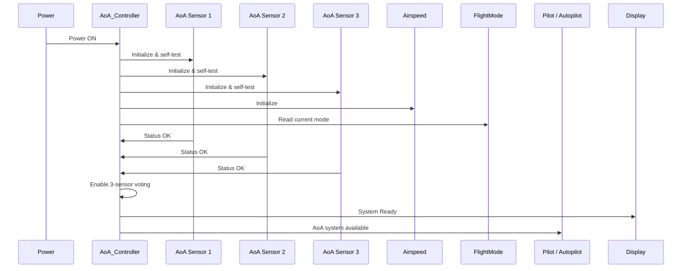
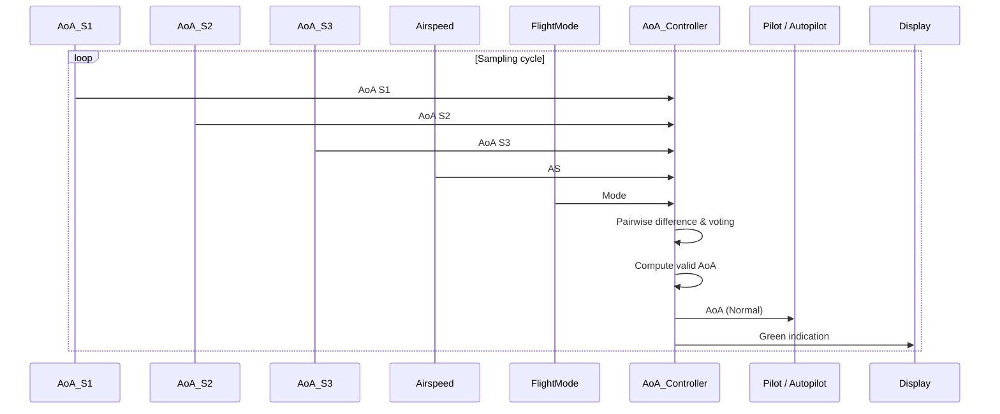
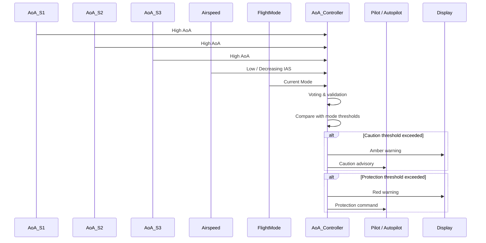
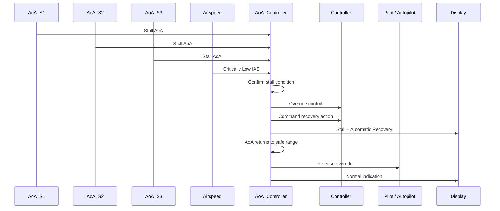

## 1. Key Sequence Diagrams

### SD-1: Power-On and Flight Initialization

---

### SD-2: Normal Operating State

---

### SD-3: Caution and Protection State

---

### SD-4: Override (Automatic Control Intervention)

---

## 2. Traceability Matrix

| Requirement | Statechart Element(s) | Sequence Diagram(s) | Test ID |
|------------|------------------------|----------------------|---------|
| R-A1 AoA system initialization | System Init | SD-1 | T-1 |
| R-A2 Normal AoA computation | Normal | SD-2 | T-2 |
| R-A3 Sensor voting & validation | SensorsAgree, SensorFailed | SD-2 | T-3 |
| R-F1 Caution warning | Caution | SD-3 | T-4 |
| R-F2 Protection command | Protection | SD-3 | T-5 |
| R-F3 Automatic override | Override | SD-4 | T-6 |
| R-S1 No action on invalid AoA | BothFailed | SD-3, SD-4 | T-7 |
| R-P1 Safe behavior on power-up | System Init | SD-1 | T-8 |

---

## 3. Test Plan

The tests are **design-level** and do not include implementation details.

---

## T-1: Startup Self-Test and Safe Initialization

**Related Requirements**
- R-A1: AoA system initialization  
- R-P1: Safe behavior on power-up  

**Purpose**  
Verify that the AoA Controller initializes safely, validates all sensors and inputs, and does not issue unintended control actions.

**Preconditions**
- Aircraft powered off  
- AoA sensors, airspeed sensor, and flight mode interface connected  
- Autopilot disengaged  

**Stimulus**
- Apply aircraft power  

**Test Steps**
1. Power on the system
2. Observe AoA sensor initialization and self-tests
3. Observe airspeed and flight mode acquisition
4. Observe system readiness indication

**Observations / Measurements**
- Sensor status flags
- System state
- Display messages
- Control output signals

**Expected Outcome**
- All sensors initialize correctly
- No protection or override commands are issued
- System enters `Normal` state

**Pass/Fail Criteria**
- PASS if system remains passive after startup
- FAIL if protection or override is triggered during initialization

---

## T-2: Normal AoA Operation (Sunny Day)

**Related Requirements**
- R-A2: Normal AoA computation  

**Purpose**  
Verify correct AoA processing under nominal flight conditions.

**Preconditions**
- System in `Normal` state  
- Valid AoA, airspeed, and flight mode inputs  

**Stimulus**
- Provide steady AoA values within safe limits  

**Test Steps**
1. Feed nominal AoA values from all sensors
2. Observe computed AoA output
3. Observe pilot/autopilot indication

**Observations / Measurements**
- AoA value
- System state
- Display indication

**Expected Outcome**
- AoA computed correctly
- Green/normal indication shown
- No warnings or control actions

**Pass/Fail Criteria**
- PASS if no warnings or overrides occur
- FAIL if system leaves `Normal` state unnecessarily

---

## T-3: Sensor Voting and Outlier Rejection

**Related Requirements**
- R-A3: Sensor voting & validation  

**Purpose**  
Verify correct identification and rejection of a faulty AoA sensor.

**Preconditions**
- System operating normally  
- Three AoA sensors active  

**Stimulus**
- Inject faulty or biased reading into one AoA sensor  

**Test Steps**
1. Introduce abnormal reading in one sensor
2. Observe pairwise difference computation
3. Observe sensor exclusion logic

**Observations / Measurements**
- Pairwise difference values
- Selected sensor pair
- Fault indication

**Expected Outcome**
- Faulty sensor is ignored
- AoA is computed using remaining two sensors
- System continues normal operation

**Pass/Fail Criteria**
- PASS if faulty data is excluded
- FAIL if faulty sensor influences AoA output

---

## T-4: Caution State Activation

**Related Requirements**
- R-F1: Caution warning  

**Purpose**  
Verify early warning behavior when AoA approaches unsafe limits.

**Preconditions**
- System in `Normal` state  
- Valid AoA and airspeed data  

**Stimulus**
- Gradually increase AoA toward caution threshold  

**Test Steps**
1. Increase AoA input
2. Cross caution threshold
3. Observe pilot/autopilot alerts

**Observations / Measurements**
- Display color/state
- Advisory messages
- System state

**Expected Outcome**
- Amber caution warning issued
- No automatic override occurs

**Pass/Fail Criteria**
- PASS if caution is issued correctly
- FAIL if warning is missing or override occurs prematurely

---

## T-5: Protection State Activation

**Related Requirements**
- R-F2: Protection command  

**Purpose**  
Verify automatic protection behavior before stall.

**Preconditions**
- System in `Caution` state  
- Low or decreasing airspeed  

**Stimulus**
- Increase AoA beyond protection threshold  

**Test Steps**
1. Cross protection threshold
2. Observe autopilot command
3. Observe pilot warning

**Observations / Measurements**
- Protection command signals
- Display warnings
- System state

**Expected Outcome**
- Protection command is issued
- Red warning displayed
- Pilot retains authority

**Pass/Fail Criteria**
- PASS if protection activates correctly
- FAIL if protection is delayed or absent

---

## T-6: Override State During Stall

**Related Requirements**
- R-F3: Automatic override  

**Purpose**  
Verify automatic control intervention during confirmed stall.

**Preconditions**
- Protection active  
- Valid AoA and airspeed inputs  

**Stimulus**
- Inject stall-level AoA and critically low airspeed  

**Test Steps**
1. Inject stall condition
2. Observe override activation
3. Observe recovery command
4. Observe override release

**Observations / Measurements**
- Override signals
- Recovery commands
- Display messages

**Expected Outcome**
- Pilot/autopilot input overridden
- Automatic recovery initiated
- Override released after recovery

**Pass/Fail Criteria**
- PASS if override is timely and reversible
- FAIL if override is missing or persistent

---

## T-7: Invalid AoA Data Handling

**Related Requirements**
- R-S1: No action on invalid AoA  

**Purpose**  
Ensure no automatic control action occurs when AoA data is unreliable.

**Preconditions**
- Two or more AoA sensors invalid or disagreeing  

**Stimulus**
- Inject conflicting sensor data  

**Test Steps**
1. Create dual sensor disagreement
2. Observe system behavior

**Observations / Measurements**
- AoA validity flag
- Protection and override outputs

**Expected Outcome**
- AoA marked `INVALID`
- No protection or override commands issued

**Pass/Fail Criteria**
- PASS if system degrades safely
- FAIL if control actions occur

---

## T-8: Power Cycle and Safe Re-entry

**Related Requirements**
- R-P1: Safe behavior on power-up  

**Purpose**  
Verify safe behavior after power interruption.

**Preconditions**
- System previously active  

**Stimulus**
- Power cycle the system  

**Test Steps**
1. Remove power
2. Restore power
3. Observe system state

**Observations / Measurements**
- System state after reboot
- Control outputs

**Expected Outcome**
- System reinitializes safely
- No automatic protection or override

**Pass/Fail Criteria**
- PASS if system remains in `Normal` without action
- FAIL if protection activates automatically

---

## 4. Gap and Risk Analysis

- Incorrect sensor outlier identification may suppress valid stall warnings  
- Airspeed sensor failure impacts stall confirmation logic  
- Flight mode misclassification affects threshold selection  
- Display latency may reduce pilot reaction time  