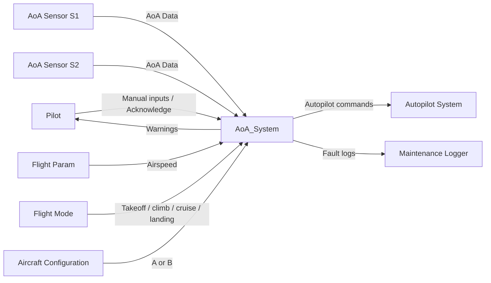
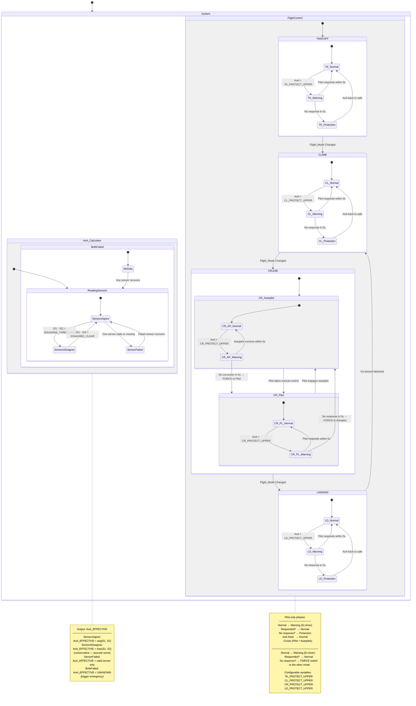

## System Boundary

### Inside the System
- Parses independent asynchronous UART frames for AoA, flight parameters, and flight mode data.
- Evaluates current AoA against safety envelopes that vary by flight mode, airspeed, and aircraft type
- Manages control authority transitions between Normal,Warning and Protection
- Motor actuation commands
- Logging of infusion and fault events

### Outside the System
- AoA sensors (S1, S2)
- Flight Mode 
- Flight Parameter (Airspeed)
- Pilot
- Autopilot

### Assumptions
- Sensor data is provided periodically and asynchronously
- Aircraft configuration (A or B) is loaded at startup and remains fixed
- Uninterrupted power supply

---

## System Context

### Actors and Interfaces

| Actor / Entity | Type | Interface Description |
|---------------|------|-----------------------|
| AoA Sensor 1 and 2  | Sensors | AoA measurement |
| Airspeed Sensor | Sensor | Transmits current airspeed |
| Flight Mode Source | System | Transmits current flight mode (TAKEOFF / CLIMB / CRUISE / LANDING)  |
| Aircraft Conguration | System | Selects Aircraft A or Aircraft B  |
| Maintenance Logger | System | Fault and safety event recording |

---

### System Context Diagram

## Selected Use Cases

| ID   | Use Case          | Actor            | Description                                      |
| ---- | ----------------- | ---------------- | ------------------------------------------------ |
| UC-1 | Monitor AoA    | AoA Sensors        | Continuously monitor and validate AoA         |
| UC-2 | Issue Warning     | System        | Warn pilot when unsafe AoA is detected          |
| UC-3 | Handle Sensor Failure | Sensors  | Detect sensor disagreement or failure         |

---

### Use Case Descriptions

#### UC-1: Monitor AoA
- Goal: Maintain a reliable AoA estimate.
- Trigger: Periodic sensor updates.
- Main Interaction: Validate sensors → compute AoA_EFFECTIVE.
- Outcome: AoA is continuously available or marked UNKNOWN.

#### UC-2: Issue Warning
- Goal: Alert pilot of unsafe AoA.
- Trigger: AoA exceeds phase-specific threshold.
- Main Interaction: Raise visual/aural alert → start response timer.
- Outcome: Pilot responds or system escalates.

#### UC-3: Handle Sensor Failure
- Goal: Maintain safety despite sensor faults.
- Trigger: Sensor stale, missing, or disagreeing.
- Main Interaction: Switch to conservative AoA selection or UNKNOWN state.
- Outcome: Warnings or emergency handling activated.

#### UC-4: Handle Power Loss
- Goal: Ensure patient safety during unexpected power loss.
- Trigger: Loss of external power.
- Main Interaction: Immediately stop infusion; system resets on power restoration.
- Outcome: System enters Safe_Stop state and does not resume infusion automatically.

---

## UML Statechart (Behavioral Model)

---
## Safety and Error Handling (Behavioral View)
- Safety events override normal operation.
- AoA UNKNOWN forces degraded or emergency handling.
- All safety-critical events are logged for traceability.
- Protection authority depends on aircraft configuration.
- Pilot always retains override capability.

## Change Log
| Date | Change          | Author  |
| ---- | --------------- | ------- | 
|   01/02/2026   | Initial version | Project Team |